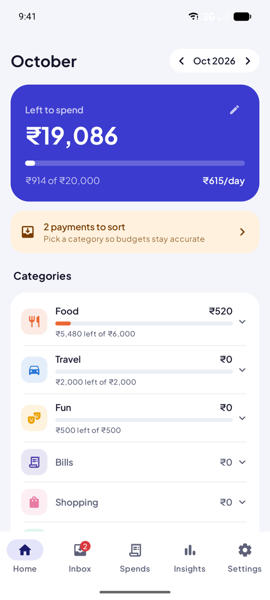
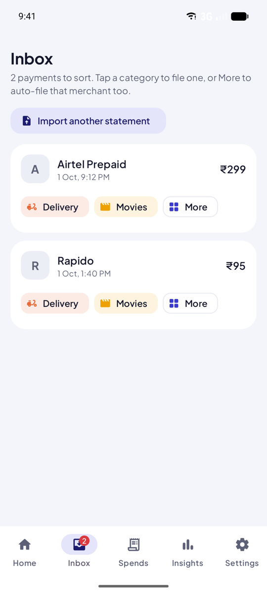
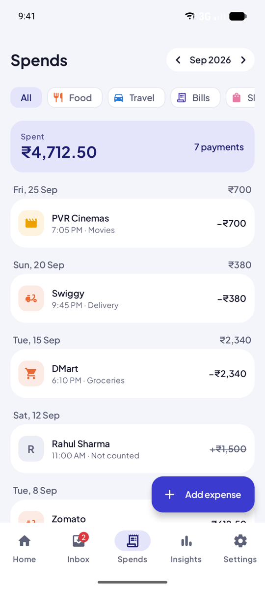
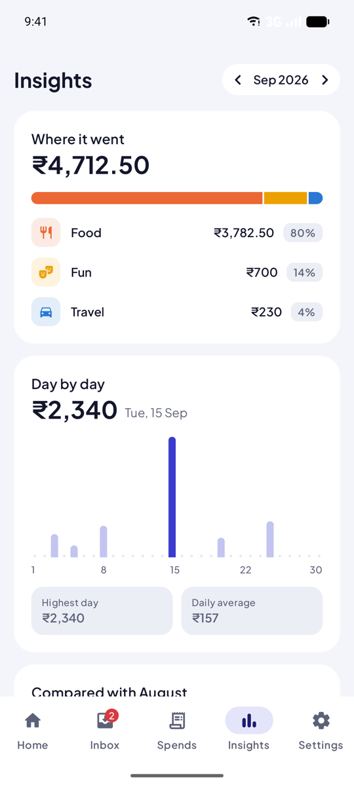
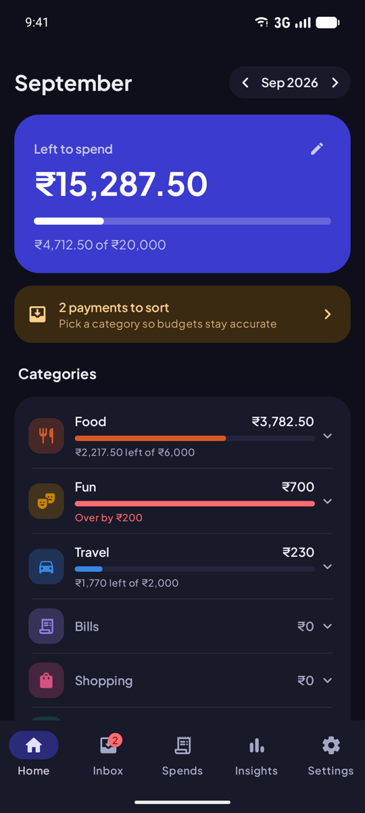

# Kharcha

**Kharcha** (खर्चा, Hindi for "expenses") is a private Android app for living on a monthly budget.
Give yourself a fixed amount for the month, import your PhonePe statement, file each payment into a
category, and always know how much you have left.

<table>
  <tr>
    <td></td>
    <td></td>
    <td></td>
    <td></td>
    <td></td>
  </tr>
  <tr>
    <td align="center">Home</td>
    <td align="center">Inbox</td>
    <td align="center">Spends</td>
    <td align="center">Insights</td>
    <td align="center">Dark mode</td>
  </tr>
</table>

## Download

**[⬇ Download kharcha.apk](https://github.com/Amirsohail007/kharcha/releases/latest/download/kharcha.apk)** (about 3.5 MB, Android 8.0 or newer).
All versions are on the [Releases page](https://github.com/Amirsohail007/kharcha/releases).

1. Open the downloaded file on your phone.
2. If asked, allow your browser or Files app to install unknown apps.
3. Google Play Protect may warn that it doesn't recognise the app, because it isn't from the Play Store. Choose **Install anyway**.

Every release is signed with the same key, so newer versions install over older ones and keep your data.
The signing certificate's SHA-256 is
`05:23:94:25:07:C5:A8:F4:6D:36:B7:0A:D7:BD:7F:3D:5C:9C:B0:FD:EF:B5:65:28:D7:9A:94:8B:5D:9D:5C:84`.

## Why

UPI makes paying effortless, which also makes it easy to lose track. PhonePe's history lists every
payment but can't tell you "₹4,000 left for food this month". Kharcha answers that one question.

## Features

- **Monthly budget**: money left to spend, a progress bar, and how much you can spend per day for the rest of the month.
- **Budgets per category**: Food ₹10,000, Travel ₹5,000 and so on, all in one list (Home → Budgets). The monthly
  total is their sum, unless you set a total of your own. Alerts at 80% and 100%.
- **PhonePe import**: share the statement PDF to the app or pick it from Files. Re-importing an overlapping statement only adds what's new.
- **Review and undo an import**: after importing you see every payment it added. Undo the whole import if it was the
  wrong statement, or pick the payments you don't want and delete them. Settings → Imports undoes an import later.
- **Delete several payments at once**: press and hold a payment in Spends or Inbox, tap more, then Delete. Deleted
  payments wait under Spends → Deleted, where you can restore them. Importing the same statement again doesn't
  bring them back; the import shows them as deleted, with a Restore button.
- **Google Drive backup**: Sync now, an automatic sync every day, and your data back after reinstalling the app.
- **Inbox**: imported payments wait here until you pick a category. One tap files a payment; "Always file here" files that merchant automatically from then on.
- **Two-level categories**: Food › Delivery, Food › Restaurant, Travel › Office, Travel › Explore and so on. Rename, add or delete any of them.
- **Insights**: where the money went, spending day by day, and this month against last month.
- **Manual entries** for cash. Mark self-transfers or money lent as "not an expense"; file money received under a category to count it as a refund.
- Light and dark theme.

## Privacy

- Everything lives in a database on your phone. There is no account and no server of ours, and no analytics.
- The app uses the internet for one thing only: **Google Drive backup**, which stays off until you connect it in
  Settings. It keeps one file in your Drive's hidden app folder, which only this app can read. Disconnecting stops
  the sync and removes the app's access; the file stays in your Drive until you delete it.
- The statement password is saved on the phone only, to fill it in on your next import. It isn't in the Drive backup.
- If Android backup is on, the app's data is included in your phone's backup to your Google account, like other apps.

## Google Drive backup

Settings → **Google Drive backup** → **Connect Google Drive**, then pick your account. The app backs up right away,
then once a day when the phone is online; **Sync now** backs up whenever you like. After reinstalling, connect the
same account and your payments, categories, budgets and rules come back. If two phones (or an old and a new install)
both have data, the app asks before replacing either side.

Building the app yourself? Drive access needs a one-time Google Cloud setup for your signing key:
see [docs/google-drive-setup.md](docs/google-drive-setup.md).

## Importing a PhonePe statement

PhonePe has no API for personal transaction history, so the app reads the statement PDF instead.

1. In PhonePe, open **History → Download Statement** and pick a date range.
2. Share the PDF to **Expenses** (the app's name on your phone), or tap **Import PhonePe statement** in the app.
3. Enter the PDF password. PhonePe uses your registered mobile number.

> **Status:** the statement parser is tested against synthetic statements built from public descriptions of
> PhonePe's format. Layouts differ between PhonePe versions, so a real statement may not import yet.
> If yours doesn't, see [Checking the parser](#checking-the-parser-against-your-statement) and open an issue.
> Redact names, phone numbers, UPI IDs and transaction IDs before sharing any statement text.

## Build from source

Requirements: Android Studio (recent) or JDK 17+ with the Android SDK, compileSdk 37. The app runs on Android 8.0 (API 26) and up.

```bash
./gradlew assembleDebug
```

Install on a phone over USB (Developer options → USB debugging):

```bash
adb install -r app/build/outputs/apk/debug/app-debug.apk
```

Or copy `app/build/outputs/apk/debug/app-debug.apk` to the phone and open it (allow "install unknown apps").

`./gradlew assembleRelease` builds the smaller, shrunk APK. It is signed only when a `keystore.properties`
file points at a signing key; without one you get an unsigned APK.

Run the unit tests:

```bash
./gradlew testDebugUnitTest
```

## Checking the parser against your statement

1. Put your statement PDF in `samples/`. This folder is gitignored, so it is never committed.
2. Put its password in `samples/password.txt`.
3. Run:

```bash
./gradlew :app:testDebugUnitTest --tests '*SampleStatementTest*' -i
```

It prints the parsed transactions and writes the extracted text to `samples/<name>.txt`.
If nothing parses, that text file shows what `PhonePeParser` needs to handle.

## How the numbers work

- Money is stored as whole paise, never as floating point.
- Payments not yet categorized still count against the monthly total.
- The monthly total budget is the sum of your category budgets (a category's own budget, else its
  subcategories' budgets added up), unless you set a total yourself.
- Deleted payments and "not an expense" payments are left out of every total.
- Money received doesn't count until you file it under a category, where it counts as a refund.
- A budget applies from the month you set it onward. Changing it never rewrites past months.
- Budget alerts fire once at 80% and once at 100%, for the current month only.

## Tech

Kotlin, Jetpack Compose with Material 3, Room, and [pdfbox-android](https://github.com/TomRoush/PdfBox-Android)
for decrypting and reading the statement. Google Play services signs you in for Drive and WorkManager runs the daily
sync; Drive itself is called over plain HTTPS. No analytics, DI or navigation libraries.

```
app/src/main/java/com/amir/expense/
├── data/       Room entities, DAO, repository, budget math, backup format
├── importer/   PDF text extraction and the PhonePe statement parser
├── alerts/     80% / 100% budget notifications
├── sync/       Google Drive backup: sign-in, REST calls, daily sync
└── ui/         Compose screens, theme and shared components
```
